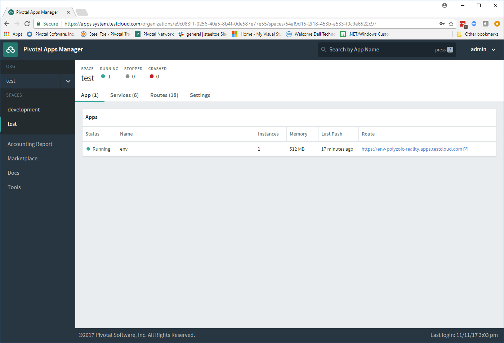
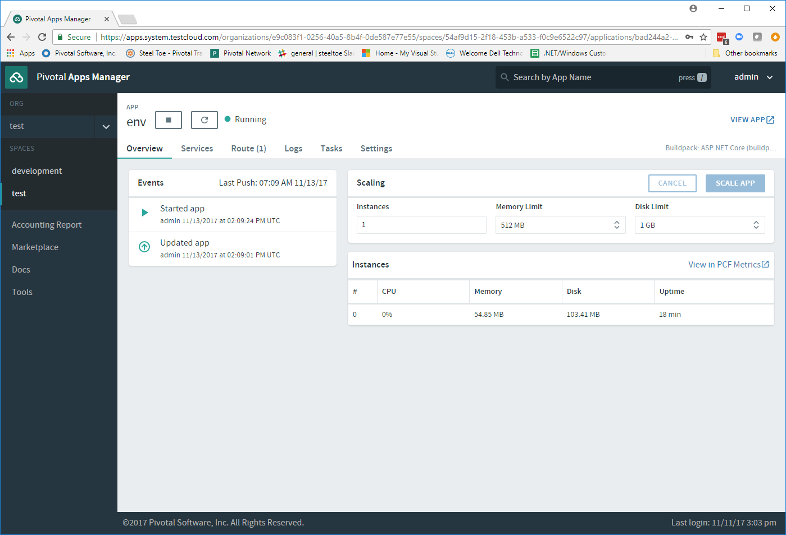
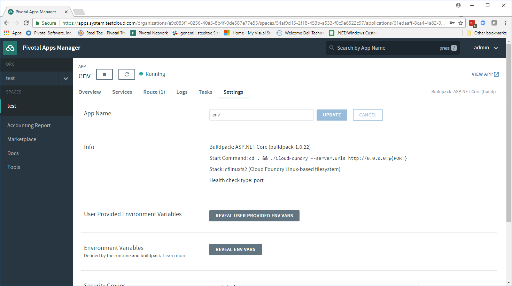

# Lab 1 - Running .NET Application on Cloud Foundry

>In this lab we will publish and push a pre-coded ASP.NET Core MVC application to Cloud Foundry.

>The application makes use of the __Steeltoe CloudFoundry Configuration Provider__ to parse the JSON configuration data provided to the application by Cloud Foundry as environment variables.

>Note: We will be using this same application for the next 4 labs (i.e. Lab1-Lab4) of the workshop.

## The Application

This is the first application we will look at that is leveraging Steeltoe.

This application was created using the out of the box ASP.NET Core MVC template used by the `dotnet` CLI.

The code generated was then modified to make use of the [Steeltoe CloudFoundry Configuration Provider](https://github.com/SteeltoeOSS/Configuration/tree/master/src/Steeltoe.Extensions.Configuration.CloudFoundry). The Steeltoe component is used to parse and access the JSON configuration data provided to it by CloudFoundry environment variables, `VCAP_APPLICATION`, `VCAP_SERVICES` and `CF_*`.

## Some Background

When Microsoft developed ASP.NET Core, the next generation of ASP.NET, they created a number of new `Extension` frameworks which provide services (e.g. Configuration, Logging, Dependency Injection, etc) commonly used or needed when building applications. While these `Extensions` are certainly used in ASP.NET Core applications, they can also be leveraged in many other application types as well; including ASP.NET 4.x, Console, UWP Apps, etc.

As you will see during this workshop, the Steeltoe project has added some additional configuration providers to the list of those offered from Microsoft.

These include:

* [CloudFoundry Configuration](https://github.com/SteeltoeOSS/Configuration/tree/master/src/Steeltoe.Extensions.Configuration.CloudFoundry)

* [Config Server Client](https://github.com/SteeltoeOSS/Configuration/tree/master/src/Steeltoe.Extensions.Configuration.ConfigServer)

To get a better understanding of the `Microsoft Configuration Extensions` have a look at the [ASP.NET Core documentation](https://docs.microsoft.com/en-us/aspnet/core/fundamentals/configuration) on the subject.

As you might expect, virtually all of Steeltoe components make use of the CloudFoundry configuration provider in one way or another.

Later on in the workshop we will take a much closer look at the `Microsoft Configuration Extensions` as well as the `Steeltoe CloudFoundry Configuration Provider`.

## Download Workshop Code

If you haven't already done so, download or clone the workshop GitHub repository using the command below.

If you don't have git installed, you can click 'Download ZIP' on the right side of the [GitHub page](https://github.com/SteeltoeOSS/Workshop).

```bash
> git clone https://github.com/SteeltoeOSS/Workshop
```

## Target Cloud Foundry

If you haven't already done so, set the Cloud Foundry target for the CLI.

Note: Use the appropriate URL for your workshop environment.

```bash
> cf api https://api.run.haas-76.pez.pivotal.io --skip-ssl-validation
```

## Login to Cloud Foundry

Follow the prompts using the credentials that you were provided by your instructor.

```bash
> cf login
```

## Open Lab Sample Application

Take a minute an open up and explore the sample application that we will be working with for the next 4 labs.  In the upcoming steps you will be directed to explore specific files and it will be easier to do so using Visual Studio.

You can find lab code `Workshop/Lab01/CloudFoundry` and a solution file `Workshop/Lab01/Lab01.sln`.

## Publish and Push the Application to Cloud Foundry

In order to get the application running on Cloud Foundry we will first publish the application into a directory using the `dotnet` CLI. Once thats complete, then we will push the published bits up to Cloud Foundry using the `cf` CLI.

1. Open a command prompt and change directory to the Lab code.

   Note in this lab we are not going to write any code. Instead we will be using the pre-coded lab in this directory.

   ```bash
   > cd Workshop/Lab01/CloudFoundry
   ```

1. Use the `dotnet` CLI to restore the NuGet references used by the application.

   ```bash
   > dotnet restore --configfile nuget.config
   ```

1. Publish the application getting it ready to push to Cloud Foundry. Pay attention to where the `dotnet` CLI creates the published application as you will have to reference that directory in the next step.

   Notice that we are specifying a specific runtime by using `-r ubuntu.14.04-x64` during our `publish` command as we will be pushing this application to a Linux cell on Cloud Foundry.

   ```bash
   > dotnet publish -r ubuntu.14.04-x64
   ```

1. Push the application to Cloud Foundry.  You will need to specifying the manifest to use to configure the application (`-f manifest.yml`) and the directory (`-p bin/Debug/netcoreapp2.0/ubuntu.14.04-x64/publish`) containing the published bits for the application.

   ```bash
   cf push -f manifest.yml -p bin/Debug/netcoreapp2.0/ubuntu.14.04-x64/publish
   ```
1. Observe the output in the command window created by the `cf push`.  

   You should see something similar to the following:

   ```bash
   ----
   Using manifest file manifest.yml

   Creating app env in org test / space test as admin...
   OK

   Creating route env-peperine-flannelette.apps.testcloud.com...
   OK

   Binding env-peperine-flannelette.apps.testcloud.com to env...
   OK

   Uploading env...
   Uploading app files from: ......
   Uploading 9.6M, 291 files
   Done uploading
   OK

   Starting app env in org test / space test as admin...
   Downloading binary_buildpack...
   Downloading nodejs_buildpack...
   Downloading staticfile_buildpack...
   Downloading java_buildpack_offline...
   Downloading ruby_buildpack...
   Downloaded java_buildpack_offline
   Downloading python_buildpack...
   Downloaded staticfile_buildpack
   Downloading go_buildpack...
   Downloaded nodejs_buildpack
   Downloading php_buildpack...
   Downloaded binary_buildpack
   Downloaded ruby_buildpack
   Downloading dotnet_core_buildpack...
   Downloaded go_buildpack
   Downloaded php_buildpack
   Downloaded dotnet_core_buildpack
   Downloaded python_buildpack
   Creating container
   Successfully created container
   Downloading app package...
   Downloaded app package (24M)
   Staging...
   -----> Buildpack version 1.0.12
   ASP.NET Core buildpack version: 1.0.12
   ASP.NET Core buildpack starting compile
   -----> Restoring files from buildpack cache
       OK
   -----> Restoring NuGet packages cache
       OK
   -----> Extracting libunwind
       libunwind version: 1.2
       file:///tmp/buildpacks/0d9923c85070a88b0dde407ea8202d62/dependencies/https___buildpacks.cloudfoundry.org_dependencies_manual-binaries_dotnet_libunwind-1.2-linux-x64-f56347d4.tgz
       OK
   -----> Saving to buildpack cache
       Copied 38 files from /tmp/app/libunwind to /tmp/cache
       OK
   -----> Cleaning staging area
       OK
   ASP.NET Core buildpack is done creating the droplet
   Exit status 0
   Staging complete
   Uploading droplet, build artifacts cache...
   Uploading droplet...
   Uploading build artifacts cache...
   Uploaded build artifacts cache (992K)
   Uploaded droplet (24.2M)
   Uploading complete
   Destroying container
   Successfully destroyed container

   1 of 1 instances running

   App started

   OK

   App env was started using this command `cd . && ./CloudFoundry --server.urls http://0.0.0.0:${PORT}`

   Showing health and status for app env in org test / space test as admin...
   OK

   requested state: started
   instances: 1/1
   usage: 1G x 1 instances
   urls: env-peperine-flannelette.apps.testcloud.com
   last uploaded: Wed Mar 15 20:57:22 UTC 2017
   stack: cflinuxfs2
   buildpack: ASP.NET Core (buildpack-1.0.12)

     state     since                    cpu    memory    disk      details
   #0   running   2017-03-15 02:57:55 PM   0.0%   0 of 1G   0 of 1G

   ```

## Understanding Cloud Foundry Push

When you push your application to Cloud Foundry there are a number of things to be aware of. Go through each of the points below and see if you can find in the output above what is being described.

* The CLI uses the manifest to provide the necessary configuration details to Cloud Foundry for the application. Things such as the application name, the memory to be allocated, the operating system to be used (in this case Linux), the number of instances to start, the environment variables to set, and the routes to use when accessing the application. Take a minute and open up `manifest.yml` to see how this is done.  There are two manifests for the application, one to be used when targeting Linux and the other for Windows. You can find them in  `Workshop/Lab01/CloudFoundry`.

* In most cases, the CLI indicates each Cloud Foundry API call as it happens. In reviewing the output above you can see the CLI has created an application named `env` and has started it in your assigned Cloud Foundry org and space.

* All HTTP/HTTPS requests to applications flow through Cloud Foundry's front-end router named the [(Go)Router](https://docs.pivotal.io/pivotalcf/1-7/concepts/architecture/router.html). Here the CLI is creating a route with random word tokens inserted to prevent route collisions across the default domain. Take a minute and look at the `manifest.yml` to see how this is done.

* The CLI is also _binding_ the created route to the application. Routes can actually be bound to multiple applications to support techniques such as [blue-green deployments](https://docs.pivotal.io/pivotalcf/1-7/devguide/deploy-apps/blue-green.html).

* The CLI finally uploads the application bits to Cloud Foundry. Notice that it's uploading several _files_, all those found in the publish directory! This is because Cloud Foundry actually uploads all the files for the deployment for caching purposes.

* When Cloud Foundry starts the application it first must run the application through the staging process. The staging process prepares the application to run on Cloud Foundry. Cloud Foundry will create two containers, one to stage the application and then a second to actually run or host the prepared bits.

* The final package of your application which is created as a result of the staging process contains all of the necessary runtime bits needed for the application to run. In Cloud Foundry terminology we refer to this as a _droplet_. You will notice from the output that the droplet is being uploaded to Pivotal Cloud Foundry's internal blob store so that it can be easily copied/replicated to one or more [Diego Cells](https://docs.pivotal.io/pivotalcf/1-7/concepts/diego/diego-architecture.html) for execution.

* Notice that the CLI tells you exactly what command and argument will be used to start your application.

* Finally, once the second container is created and the application has been started, the CLI reports the current status of your application's health, including the number of instances started, what stack it's running on and the URL(s) that can be used to access it.

## View Application in AppsManager

Take some time to explore the application using the Pivotal AppsManager.

1. Open AppsManager and if necessary, select org and space that the `env` application is running in.

   ---

   

   ---

1. Select the `env` application.

   ---

   

   ---

1. Select the `Settings` tab.

   ---

   

   ---

1. Click the `Reveal Env Vars` button to see the environment variables for the application.

   Notice the environment variables `VCAP_APPLICATION` and `VCAP_SERVICES`. These are assigned by CloudFoundry and are intended to provide configuration data for the application. This is the configuration information the `Steeltoe CloudFoundry Configuration Provider` is parsing and making available to the application.

   Here is an example of the kind of information you should see:

```text
{
  "staging_env_json": {},
  "running_env_json": {},
  "environment_json": "invalid_key",
  "system_env_json": {
    "VCAP_SERVICES": {}
  },
  "application_env_json": {
    "VCAP_APPLICATION": {
      "cf_api": "https://api.system.testcloud.com",
      "limits": {
        "fds": 16384,
        "mem": 1024,
        "disk": 1024
      },
      "application_name": "env",
      "application_uris": [
        "env-uninebriating-impaler.apps.testcloud.com"
      ],
      "name": "env",
      "space_name": "test",
      "space_id": "86111584-e059-4eb0-b2e6-c89aa260453c",
      "uris": [
        "env-uninebriating-impaler.apps.testcloud.com"
      ],
      "users": null,
      "application_id": "c21b464e-243a-43fc-86b2-1545c90e2239",
      "version": "e5f8aff9-4434-4f54-a4c4-c84569c3d8b3",
      "application_version": "e5f8aff9-4434-4f54-a4c4-c84569c3d8b3"
    }
  }
}
```

## Interact with the Application

1. Visit the `env` application in your browser by hitting the route that was generated by the CLI.  Do a `cf a` to see what URL to use if your unsure of what the route is for the application. 

   You should see something like shown below when you hit the app.

   ---

   

   ---

1. Click on the `CloudFoundry Config` menu item. You should see something like shown below.

   ---

   

   ---

1. Click on the `Application Config` menu item. You should see something like shown below.

   ---

   

   ---

1. Click on the `Subsection Config` menu item. You should see something like shown below.

   ---

   

   ---

1. Click on the `Raw Config` menu item. You should see something like shown below.

   ---

   

   ---

## Understanding the Application Code

1. To see how the Cloud Foundry configuration data is integrated into the overall configuration for the app start with the code in `Program.cs`.  Have a look at the `CreateDefaultBuilder(args)` call. Notice the usage of the Steeltoe `AddCloudFoundry()` method call. This is what causes the Cloud Foundry configuration data (i.e. `VCAP_APPLICATION`, etc.) to be added to the apps configuration.

    For more detail on how ASP.NET Core Host building is done,  read over the Microsoft documentation - [Setting up a Host](https://docs.microsoft.com/en-us/aspnet/core/fundamentals/hosting?tabs=aspnetcore2x).

    For information on how an applications configuration is established, read over the Microsoft documenation on [Configuration](https://docs.microsoft.com/en-us/aspnet/core/fundamentals/configuration?tabs=basicconfiguration).

    In upcoming labs we will spend much more time on how this all works!

1. Above when you clicked on `CloudFoundry Config` menu item what you were observing is the configuration information from `VCAP_APPLICATION` and `VCAP_SERVICES`. To see in the code how this view is created start with the `CloudFoundryConfig()` action in the `HomeController`.

1. When you clicked on `Application Config` menu item what you were observing is the configuration information from `appsettings.json` and `appsettings-Development.json`, both configuration files found in the applications solution. To see in the code how this view is created start with the `AppConfig()` action in the `HomeController`.

1. When you clicked on `Subsection Config` menu item what you were observing is a subsection of the configuration data from `appsettings.json` and `appsettings-Development.json`. Take some time and see if you can find in the code how this is accomplished. To see in the code how this view is created start with the `SubSectionConfig()` action in the `HomeController`.

1. When you clicked on the `Raw Config` menu item what you were observing is a raw listing of all the configuration information available to the application. To see in the code how this view is created start with the `RawConfig()` action in the `HomeController`.

## Interact with Application from CF CLI

1. Get information about the currently deployed application using CLI apps command:

   ```bash
   > cf apps
   ```

   Note the application name for next steps.

1. Get information about running instances, memory, CPU, and other statistics using CLI instances command.

   ```bash
   > cf app env
   ```

1. Restart the deployed application using the CLI.

   ```bash
   > cf restart env
   ```

1. Stop the deployed application using the CLI.

   ```bash
   > cf stop env
   ```

1. Delete the deployed application using the CLI

   ```bash
   > cf delete env
   ```